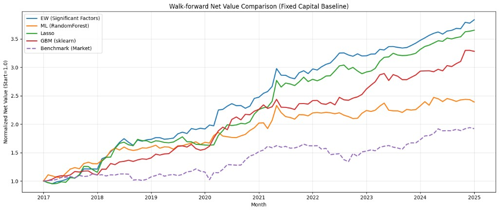

## TMBA — 台股財報因子 Walk-Forward 多空策略研究

以台股上市公司 **TEJ 財報資料**與月頻報酬為基礎，建立可重演的 **walk-forward（樣本外）** 量化研究流程：資料清理 → 因子篩選 → 多模型評分 → 多空投組 → 固定本金回測，並將結果輸出為 Excel / CSV 便於檢視與比較。

## 做了什麼（高層摘要）

- **資料處理**：將原始財報欄位轉為數值，並以缺漏/零值比例門檻做品質篩選，形成可用的因子池。
- **避免前視偏誤**：每個形成月 \(t\) 只使用 `年/月 < t` 的歷史資料挑因子/訓練模型，並以該月截面資料打分排序；持有績效使用已對齊的「下期月報酬」欄位評估。
- **因子篩選**：在訓練窗中對各候選因子做單變量 OLS（對下期報酬），以 p-value 排序並做高相關去重，取前 \(k\) 個因子。
- **評分方法（策略線）**：
  - **EW（傳統線性）**：選入因子標準化後，依迴歸係數正負對齊方向，做等權合成分數。
  - **Random Forest（ML）**：以篩選後因子為特徵，訓練樹模型預測下期報酬作為排序分數。
  - **Lasso（稀疏線性）**：`StandardScaler → Lasso` 管線，輸出預測值作為排序分數。
  - **GBM（梯度提升樹）**：`GradientBoostingRegressor`，輸出預測值作為排序分數。
- **投組與回測**：每月依分數做多頭 top N、空頭 bottom N；採固定本金、含換手與交易成本假設，並支援空頭月停損上限（可關閉）。

## 專案結構

- `tmba_code/factors.ipynb`：主要 notebook（資料清理、walk-forward 回測、圖表、輸出 `walkforward_results.xlsx` 與 `walkforward_summary.xlsx`）。
- `docs/nav.png`：EW / RF / Lasso / GBM / Benchmark 的淨值對照圖（可直接用於簡報/分享）。

## 如何跑（最簡單）

1. 開啟 `tmba_code/factors.ipynb`
2. 依序執行各 cell（讀資料 → 回測 → 輸出）
3. 主要輸出在 `C:\python\tmba\`：
   - `walkforward_results.xlsx`：各策略 perf / positions / factors / monthly returns
   - `walkforward_summary.xlsx`：一目瞭然的彙總表（績效總覽、因子頻率、每月持股、標的統計…）

> 注意：原始資料檔（大型 `.csv` / `.xlsx`）未納入 repo（見 `.gitignore`），請自行放在 notebook 內指定的路徑或改成相對路徑。

## 免責聲明

此專案為研究/教學用途之回溯測試示範，不構成投資建議；回測結果不代表未來績效。

